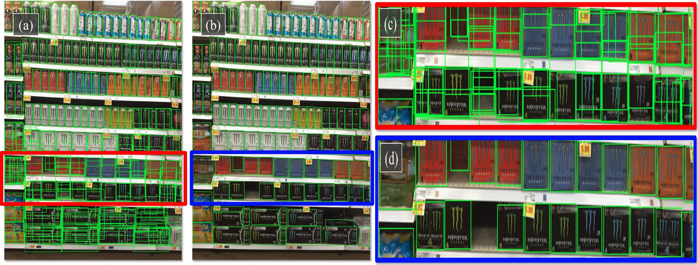
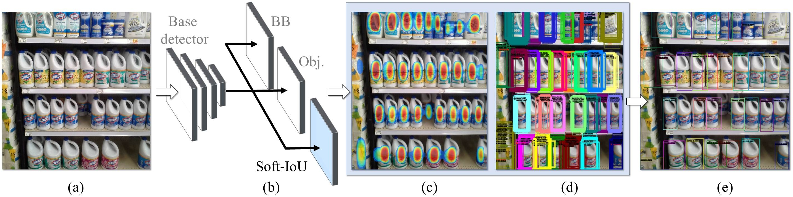
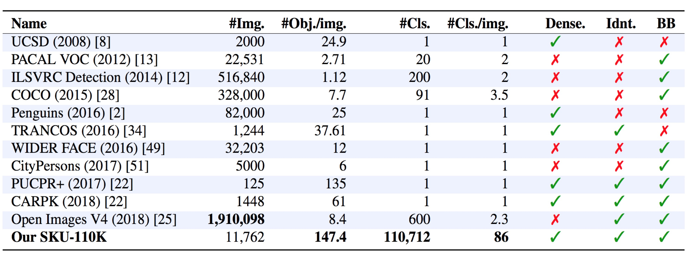
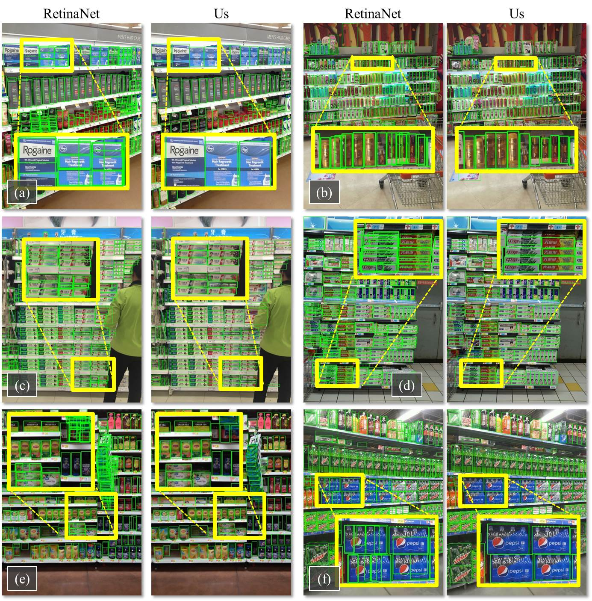

# SKU-110K
#### Eran Goldman* , [Roei Herzig*](https://roeiherz.github.io/) , Aviv Eisenschtat*, [Jacob Goldberger](http://www.eng.biu.ac.il/goldbej/), [Tal Hassner](https://talhassner.github.io/home/)

Dataset and Codebase for CVPR2019 "Precise Detection in Densely Packed Scenes" [[Paper link]](https://arxiv.org/pdf/1904.00853.pdf)

<!---[alt text](figures/teaser_width.jpg)--->


A typical image in our SKU-110K, showing densely packed objects. (a) Detection results for the state-of-the-art RetinaNet[2], showing incorrect and overlapping detections, especially for the dark objects at the bottom which are harder to separate. (b) Our results showing far fewer misdetections and better fitting bounding boxes. (c) Zoomed-in views for RetinaNet[2] and (d) our method.


### Our novel contributions are:
1. **Soft-IoU layer**, added to an object detector to estimate the Jaccard index between the detected box and the (unknown) ground truth box.
2. **EM-Merger unit**, which converts detections and Soft-IoU scores into a MoG (Mixture of Gaussians), and resolves overlapping detections in packed scenes.
3. **A new dataset and benchmark**, the store keeping unit, 110k categories (SKU-110K), for item detection in store shelf images from around the world.

## Introduction
In our SKU-110K paper[1] we focus on detection in densely packed scenes, where images contain many objects, often looking similar or even identical, positioned in close proximity. These scenes are typically man-made, with examples including retail shelf displays, traffic, and urban landscape images. Despite the abundance of such environments, they are under-represented in existing object detection benchmarks, therefore, it is unsurprising that state-of-the-art object detectors are challenged by such images.


## Method
We propose learning the Jaccard index with a soft Intersection over Union (Soft-IoU) network layer. This measure provides valuable information on the quality of detection boxes. Those detections can be represented as a Mixture of Gaussians (MoG), reflecting their locations and their Soft-IoU scores. Then, an Expectation-Maximization (EM) based method is then used to cluster these Gaussians into groups, resolving detection overlap conflicts. 



System diagram: (a) Input image. (b) A base network, with bounding box (BB) and objectness (Obj.) heads, along
with our novel Soft-IoU layer. (c) Our EM-Merger converts Soft-IoU to Gaussian heat-map representing (d) objects captured by
multiple, overlapping bounding boxes. (e) It then analyzes these box clusters, producing a single detection per object


## Dataset



We compare between key properties for related benchmarks. **#Img.**: Number of images. **#Obj./img.**: Average items per image. **#Cls.**: Number of object classes (more implies a harder detection problem due to greater appearance variations). **#Cls./img.**: Average classes per image. **Dense**: Are objects typically densely packed together, raising potential overlapping detection problems?. **Idnt**: Do images contain multiple identical objects or hard to separate object sub-regions?. **BB**: Bounding box labels available for measuring detection accuracy?.

The dataset is provided for the exclusive use by the recipient and solely for academic and non-commercial purposes. 

The dataset can be downloaded from <a href="http://trax-geometry.s3.amazonaws.com/cvpr_challenge/SKU110K_fixed.tar.gz"> here</a> or <a href="https://drive.google.com/file/d/1iq93lCdhaPUN0fWbLieMtzfB1850pKwd">here</a>.

A pretrained model is provided <a href="https://drive.google.com/file/d/1f9tRzJSqjuUQzXz8WjJC0V_WD-8y_6wy/view?usp=sharing">here</a>. Note that its performance is slighly better than originally reported in the paper because of improved optimization.

##  CVPR 2020 Challenge
The detection challenge was held in CVPR 2020 Retail-Vision workshop.
Please visit our [workshop page](https://retailvisionworkshop.github.io/) for more information. The data and evaluation code are available in the [challenge page](https://retailvisionworkshop.github.io/detection_challenge_2020/).

## Qualitative Results
Qualitative detection results on SKU-110K. 



## Notes

**Please note that the main part of the code has been released, though we are still testing it to fix possible glitches. Thank you.**

This implementation is built on top of https://github.com/fizyr/keras-retinanet.
The SKU110K dataset is provided in csv format compatible with the code CSV parser.

Dependencies include: `keras`, `keras-resnet`, `six`, `scipy`. `Pillow`, `pandas`, `tensorflow-gpu`, `tqdm`
This repository requires `Keras 2.2.4` or higher, and was tested using `Python 3.6.5`, `Python 2.7.6`  and `OpenCV 3.1`.

The output files will be saved under "$HOME"/Documents/SKU110K and have the same structure as in https://github.com/fizyr/keras-retinanet:
The weight h5 files will are saved in the "snapshot" folder and the tensorboard log files are saved in the "logs" folder.

Note that we have made several upgrades to the baseline detector since the beginning of this research, so the latest version can actually
achieve even higher results than the ones originally reported.

The EM-merger provided here is the stable version (not time-optimized). Some of the changes required for
optimization are mentioned in the TO-DO comments.

Contributions to this project are welcome.

## Usage

Move the unzipped SKU110K folder to "$HOME"/Documents

Set $PYTHONPATH to the repository root 

e.g. from this repository: `export PYTHONPATH=$(pwd)`

train:

(1) Train the base model:
`python -u object_detector_retinanet/keras_retinanet/bin/train.py csv`

(2) Train the IoU layer:

`python -u object_detector_retinanet/keras_retinanet/bin/train_iou.py --weights WEIGHT_FILE csv`
where WEIGHT_FILE is the full path to the h5 file from step (1)

e.g.:
`python -u object_detector_retinanet/keras_retinanet/bin/train_iou.py --gpu 0 --weights "/home/ubuntu/Documents/SKU110K/snapshot/Thu_May__2_17:07:11_2019/resnet50_csv_10.h5" csv | tee train_iou_sku110k.log`


(3) predict:

`python -u object_detector_retinanet/keras_retinanet/bin/predict.py csv WEIGHT_FILE [--hard_score_rate=RATE]`
where WEIGHT_FILE is the full path to the h5 file from step (2), and 0<=RATE<=1 computes the confidence as a weighted average between soft and hard scores. 

e.g:
`nohup env PYTHONPATH="/home/ubuntu/dev/SKU110K" python -u object_detector_retinanet/keras_retinanet/bin/predict.py --gpu 3 csv "/home/ubuntu/Documents/SKU110K/snapshot/Thu_May__2_17:10:30_2019/iou_resnet50_csv_07.h5" --hard_score_rate=0.5 | tee predict_sku110k.log`


The results are saved in CSV format in the "results" folder and drawn in "res_images_iou" folder.

## References
[1] Eran Goldman*, Roei Herzig*, Aviv Eisenschtat*, Jacob Goldberger, Tal Hassner, [Precise Detection in Densely Packed Scenes](https://arxiv.org/abs/1904.00853), 2019.

[2] Tsung-Yi Lin, Priyal Goyal, Ross Girshick, Kaiming He, Piotr Dollar, [Focal loss for dense object detection](https://arxiv.org/abs/1708.02002), 2018.


## Citation

```
@inproceedings{goldman2019dense,
 author    = {Eran Goldman and Roei Herzig and Aviv Eisenschtat and Jacob Goldberger and Tal Hassner},
 title     = {Precise Detection in Densely Packed Scenes},
 booktitle = {Proc. Conf. Comput. Vision Pattern Recognition (CVPR)},
 year      = {2019}
}
```
